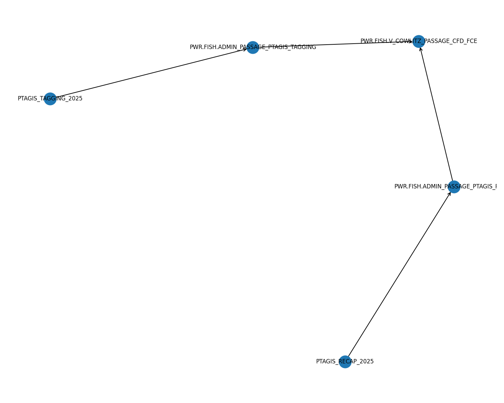

## Project Graph

[➡️ Open the interactive graph](https://joshankeny.github.io/metadata_aggregator/graph.html)

## Data sources

- 📄 [datasources.csv](data/datasources.csv) — latest table (auto-updated by Actions)
- 📄 [datasources.json](data/datasources.json)
- 🔗 Raw CSV (for external tools):  
  https://raw.githubusercontent.com/joshankeny/metadata_aggregator/main/data/datasources.csv
